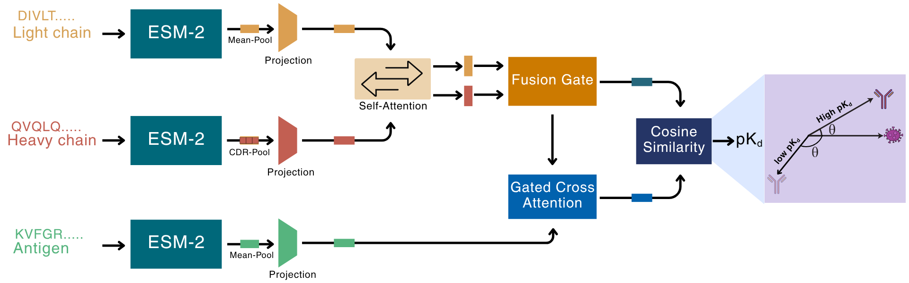

# AbAffinity — Chain-Aware Tri-Stream Antibody–Antigen Binding-Affinity Prediction

[](https://colab.research.google.com/github/harshitsinghsnu/AgAbAffinity/blob/main/notebooks/AgAbGated_Custom_ZeroShot_FewShot_IG.ipynb)

> **Motivation.** Antibody–antigen affinity governs therapeutic antibody discovery, B-cell receptor
> repertoire analysis and affinity maturation, yet it is difficult to predict at the scale required
> for sequence-library screening. Structure-based models can be informative but depend on reliable
> complexes or docking models, while many sequence-based approaches collapse heavy and light chains
> or fuse antibody and antigen information before modelling partner compatibility.
>
> **Results.** We introduce **AbAffinity**, a sequence-only chain-aware three-stream architecture that
> represents heavy chain, light chain and antigen as distinct but interacting streams where protein
> language model features are combined with heavy-chain CDR-focused pooling, heavy–light
> self-attention, learned antibody fusion and gated antibody–antigen cross-attention, leaving only a
> compact interaction module to be trained. On SAaIntDB complexes, AbAffinity achieves Pearson
> r = 0.858 ± 0.006, Spearman ρ = 0.844 ± 0.009 and RMSE = 0.694 ± 0.014 under ten-fold
> cross-validation. Ablations show that CDR pooling, heavy/light factorisation, authentic antigen
> input and the gated interaction pathway each contribute to performance. Integrated Gradients
> attribution recovers known paratope and epitope residues with high fidelity, providing biologically
> grounded explainability. The model transfers effectively to external benchmarks and mutational
> landscapes, supporting zero- and few-shot adaptation for affinity maturation when structural
> information is incomplete or unavailable.

A sequence-only model that predicts antibody–antigen binding affinity (pK_d) directly from heavy,
light and antigen sequences. Frozen **ESM-2 (650M)** embeddings are pooled (heavy chain over its
**CDR-H1/H2/H3** loops, light and antigen by mean), kept as three separate streams, coupled by a
heavy↔light **fusion gate** and a **gated cross-attention** interaction, and read out by a bounded
**cosine** head. One model spans conventional paired antibodies and single-domain nanobodies.




## Repository layout

```
AgAbAffinity/
├── AbAffinity/                # the importable Python package
│   ├── models/               # MutualTriStreamStrong (final) + variants
│   ├── utils/                # data loading, metrics, training loops
│   ├── training/             # CV / benchmark / multi-seed runners, ablations
│   ├── explain/              # integrated-gradients attribution + gate importance
│   └── data_prep/            # ESM-2 embedding precompute / All-CDR caching
├── configs/
│   ├── saaintdb/             # SAaIntDB configs (All-CDR / mean-pool × random / cold)
│   └── benchmark/            # external-dataset configs (CV + SAbDab→benchmark)
├── data/                     # pair tables, SAaIntDB rows, complexes.json, AND prebuilt caches:
│   ├── allcdr_natural_650M.pkl          # SAbDab + benchmark, All-CDR pooled
│   ├── allcdr_mutation_650M.pkl         # AB-Bind + SKEMPI, All-CDR pooled
│   ├── esm2_embeddings_saaintdb_650M.pkl
│   └── saaintdb_heavy_cdr_embeddings.pkl
├── model_weights/
│   └── saaintdb_allcdr_random_bestfold.pt   # final model, SAaIntDB random best fold
├── notebooks/                # custom run (Colab) + publication panels + explainability
├── environment.yml / requirements.txt / pyproject.toml
```


## Installation

```bash
conda env create -f environment.yml      # exact pins used for every reported number
conda activate AbAffinity
pip install -e .                          # makes `import AbAffinity` available
```

---

## Quick start — run on **your own** data (local or Google Colab)

**[▶ Open the quick-start notebook in Google Colab](https://colab.research.google.com/github/harshitsinghsnu/AgAbAffinity/blob/main/notebooks/AgAbGated_Custom_ZeroShot_FewShot_IG.ipynb)**

`notebooks/AgAbGated_Custom_ZeroShot_FewShot_IG.ipynb` is the recommended entry point. Click the
badge above to open it in Colab and **Run all** — the first cell clones this repo and installs the
runtime dependencies, then the notebook loads `model_weights/saaintdb_allcdr_random_bestfold.pt` and,
from a CSV of your complexes (`light, heavy, antigen, Y`), runs end to end:

1. **Zero-shot** affinity prediction (frozen model) → Pearson / Spearman / RMSE,
2. **Few-shot** fine-tuning on a fraction of your labels (validation early-stopping, held-out test),
3. **Integrated Gradients** per-residue attribution → heatmap,
4. **Structure mapping** — top-attribution residues highlighted on the 3D structure, rendered inline.

It runs on the bundled 60-complex SAaIntDB sample out of the box; replace `DATA_CSV` (or use the
Colab upload helper) with your own CSV to score your sequences. A GPU runtime is recommended for the
ESM-2 embedding step but not required.

---


### SAaIntDB 

```bash
python -m AbAffinity.training.run_saaintdb_multiseed --config configs/saaintdb/sa_ours_allcdr_random.yaml
python -m AbAffinity.training.run_saaintdb_multiseed --config configs/saaintdb/sa_ours_allcdr_cold.yaml
```
Default seeds `42 114 144`; results → `results/results_saaintdb/<name>/aggregated_summary.csv`.

### External MVSF-AB datasets 

Same final model (`MutualTriStreamStrong`, All-CDR pooling), driven by `configs/benchmark/`:

```bash
# 10-fold CV on SAbDab, AB-Bind and SKEMPI:
python -m AbAffinity.training.run_multiseed --config configs/benchmark/exp02_ours_allcdr_cv.yaml

# Train on 100% SAbDab, evaluate on the held-out benchmark:
python -m AbAffinity.training.run_multiseed --config configs/benchmark/exp04_ours_allcdr_benchmark.yaml

# Or every benchmark config at once:
python -m AbAffinity.training.run_multiseed --all
```
Default seeds `42 114 144 314 777`; results → `results/<name>/aggregated_summary.csv` +
`results/MASTER_SUMMARY.csv`.

> **Rebuilding caches from raw sequences** (only needed if you change the data): regenerate the
> embeddings with `python -m AbAffinity.data_prep.precompute_embeddings_saaintdb` and
> `python -m AbAffinity.data_prep.precompute_allcdr_cache` before running the commands above.

---

## Notebooks

- **`AgAbGated_Custom_ZeroShot_FewShot_IG.ipynb`** — run the model on a custom CSV (Colab-ready):
  zero-shot, few-shot, IG heatmap, inline structure mapping (above).

## Data format

All pair tables and the custom-notebook CSV use four columns: `light`, `heavy`, `antigen`, `Y`
(affinity in pK_d). 
